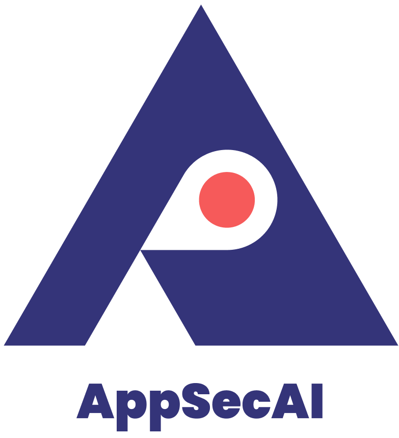

<p align="center">
  
</p>

# AppSecAI Vulnerability Analysis

[](https://github.com/AppSecureAI/automation-action/actions/workflows/ci.yml)
[](./badges/coverage.svg)
[](https://opensource.org/licenses/MIT)

This GitHub Action provides automated security vulnerability triage,
remediation, and validation powered by AI. Submit SARIF or JSON security scan
results to the AppSecAI platform for intelligent analysis of your source code.

## Quick Start

```yaml
- name: AppSecAI Security Analysis
  uses: AppSecureAI/automation-action@v1
  with:
    file: sarif-results.sarif
```

## Prerequisites

Before using this action, install the
[AppSecAI App](https://github.com/apps/appsecai-app) GitHub App and grant it
access to your repository.

1. **Install the App:**
   [Click here to install](https://github.com/apps/appsecai-app)
2. **Grant repository access:** Ensure the app has access to your target
   repository

## Inputs

| Input  | Description                                     | Required |
| ------ | ----------------------------------------------- | -------- |
| `file` | SARIF or JSON file path containing scan results | Yes      |

## Outputs

| Output    | Description                       |
| --------- | --------------------------------- |
| `message` | Processed message from the action |

## Usage

### Step 1: Add Required Permissions

```yaml
permissions:
  contents: read
  id-token: write
```

### Step 2: Add the Action

```yaml
- name: AppSecAI Security Analysis
  uses: AppSecureAI/automation-action@v1
  with:
    file: scan-results.sarif
```

### Using a Specific Version

We recommend using the major version tag (`@v1`) for stability. You can also pin
to a specific version:

```yaml
uses: AppSecureAI/automation-action@v1      # Recommended: latest v1.x
uses: AppSecureAI/automation-action@v1.0.0  # Pin to specific version
```

See the
[Releases page](https://github.com/AppSecureAI/automation-action/releases) for
all available versions and changelogs.

## Version Policy

This action follows [Semantic Versioning](https://semver.org/) (SemVer) to
ensure predictable updates and backwards compatibility.

### Versioning Schema

Given a version number `MAJOR.MINOR.PATCH` (e.g., `v1.2.3`):

- **MAJOR** version: Incremented for incompatible API changes that may break
  existing workflows
- **MINOR** version: Incremented for new features added in a
  backwards-compatible manner
- **PATCH** version: Incremented for backwards-compatible bug fixes and minor
  improvements

### Version Tags

We maintain multiple tag types for flexibility:

- **Major version tags** (e.g., `@v1`): Automatically updated to include the
  latest `v1.x.x` release
  - **Recommended for most users**: Provides automatic updates while maintaining
    compatibility
  - Example: `uses: AppSecureAI/automation-action@v1`
- **Specific version tags** (e.g., `@v1.0.6`): Pinned to an exact release
  - **Recommended for strict reproducibility**: No automatic updates
  - Example: `uses: AppSecureAI/automation-action@v1.0.6`
- **Commit SHA** (e.g., `@8a14146`): Pinned to a specific commit
  - **For maximum control**: Immutable reference
  - Example: `uses: AppSecureAI/automation-action@8a14146`

### Release Frequency

- **Patch releases**: As needed for bug fixes and security updates
- **Minor releases**: Periodically for new features
- **Major releases**: Only when necessary for breaking changes

### Changelog and Release Notes

All releases are documented on the
[Releases page](https://github.com/AppSecureAI/automation-action/releases) with:

- Detailed changelog of what's new, fixed, or changed
- Migration guides for major version upgrades
- Known issues and workarounds (if applicable)

We recommend subscribing to releases via GitHub's "Watch" feature to stay
informed of updates.

## Examples

### Basic Usage with Bandit

```yaml
name: Security Scan

on:
  push:
    branches: [main]
  pull_request:
    branches: [main]

jobs:
  security-scan:
    runs-on: ubuntu-latest
    permissions:
      contents: read
      id-token: write

    steps:
      - uses: actions/checkout@v4

      - name: Set up Python
        uses: actions/setup-python@v5
        with:
          python-version: '3.11'

      - name: Install and Run Bandit
        run: |
          pip install bandit
          bandit -r . --exit-zero -ll -f json -o bandit_results.json \
            -x "tests/*,test/*,venv/*"

      - name: AppSecAI Security Analysis
        uses: AppSecureAI/automation-action@v1
        with:
          file: bandit_results.json
```

### Using Semgrep

```yaml
- name: Run Semgrep
  run: semgrep --config=auto --json > semgrep_results.json

- name: AppSecAI Analysis
  uses: AppSecureAI/automation-action@v1
  with:
    file: semgrep_results.json
```

## Supported SAST Tools

This action works with output from various static analysis tools:

- [Bandit](https://bandit.readthedocs.io/) (Python)
- [Semgrep](https://semgrep.dev/) (Multiple Languages)
- [CodeQL](https://codeql.github.com/) (Multiple Languages)
- Any tool outputting SARIF or compatible JSON format

### Generating Input Files

**Bandit (JSON):**

```sh
bandit -r . -f json -o bandit_results.json
```

**Semgrep (JSON):**

```sh
semgrep --config=auto --json > semgrep_results.json
```

**CodeQL (SARIF):**

```sh
codeql database analyze <db> <qlpack> --format=sarifv2.1.0 --output=codeql-results.sarif
```

## Troubleshooting

### Permissions Error

**Problem:** `Resource not accessible by integration` or similar permission
errors.

**Solution:** Add required permissions to your workflow:

```yaml
permissions:
  contents: read
  id-token: write
```

### App Not Installed

**Problem:** Authentication or API access denied errors.

**Solution:** Install the [AppSecAI App](https://github.com/apps/appsecai-app)
GitHub App and grant it access to your repository.

### File Not Found

**Problem:** `Empty file` or `File not found` errors.

**Solution:**

- Verify the `file` input path is correct
- Ensure the SAST tool runs before this action
- Check that the output file exists at the specified location

### Still Having Issues?

[Open an issue](https://github.com/AppSecureAI/automation-action/issues) with
your workflow configuration and error messages.

## Documentation

For comprehensive documentation, visit the
[AppSecAI Documentation](https://portal.cloud.appsecai.io/docs).

## Contributing

Contributions are welcome! Please see our
[Contributing Guidelines](CONTRIBUTING.md) for details.

## License

This project is licensed under the MIT License - see the [LICENSE](LICENSE) file
for details.
