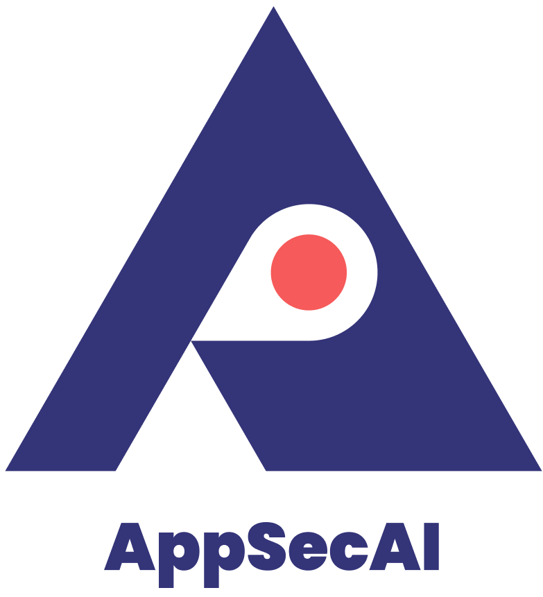

<p align="center">
  
</p>

# AppSecAI Expert Fix Automation (EFA)

[](https://github.com/AppSecureAI/automation-action/actions/workflows/ci.yml)
[](./badges/coverage.svg)
[](https://opensource.org/licenses/MIT)

This GitHub Action provides automated security vulnerability triage,
remediation, and validation powered by AI. Submit SARIF, JSON, CSV, or TSV
security scan results to the AppSecAI platform for intelligent analysis of your
source code.

When the submit API returns an `organization_id`, the action uses the matching
org-scoped status and finalize endpoints for subsequent polling.

## Quick Start

```yaml
- name: AppSecAI Expert Fix Automation
  uses: AppSecureAI/automation-action@v1
  env:
    PROCESSING_MODE: group_cc
    AUTO_CREATE_PRS: 'true'
  with:
    file: sarif-results.sarif
```

## Prerequisites

Before using this action, install the
[AppSecAI App](https://github.com/apps/appsecai-app) GitHub App and grant it
access to your repository.

This action runs with Node.js `22.14.0` internally via `actions/setup-node`.

1. **Install the App:**
   [Click here to install](https://github.com/apps/appsecai-app)
2. **Grant repository access:** Ensure the app has access to your target
   repository

## Inputs

| Input                                      | Description                                                | Required | Default                    |
| ------------------------------------------ | ---------------------------------------------------------- | -------- | -------------------------- |
| `file`                                     | SARIF, JSON, CSV, or TSV file path containing scan results | Yes      | -                          |
| `update-context`                           | Trigger fresh security context extraction before the scan  | No       | `false`                    |
| `regression-evidence-base-ref`             | Base git ref for regression evidence diff calculation      | No       | `''`                       |
| `regression-evidence-base-sha`             | Base git SHA for regression evidence diff calculation      | No       | `''`                       |
| `regression-evidence-head-ref`             | Head git ref for regression evidence diff calculation      | No       | `''`                       |
| `regression-evidence-head-sha`             | Head git SHA for regression evidence diff calculation      | No       | `''`                       |
| `regression-evidence-coverage-artifacts`   | Comma/newline-separated coverage mapping artifact paths    | No       | `''`                       |
| `regression-evidence-test-commands`        | Newline-separated test commands (supports `{{tests}}`)     | No       | `''`                       |
| `regression-evidence-output-json-path`     | Output path for `regression-evidence.json`                 | No       | `regression-evidence.json` |
| `regression-evidence-output-markdown-path` | Output path for markdown summary                           | No       | `regression-evidence.md`   |
| `regression-evidence-allow-partial`        | Allow `partial` status when changed lines are uncovered    | No       | `true`                     |
| `regression-evidence-fail-on-at-risk`      | Fail action when status is `at_risk`                       | No       | `false`                    |

## Configuration

Configure the action behavior using environment variables in your workflow:

| Environment Variable                        | Description                                                                                                                                               | Default                    |
| ------------------------------------------- | --------------------------------------------------------------------------------------------------------------------------------------------------------- | -------------------------- |
| `CREATE_ISSUES_FOR_INCOMPLETE_REMEDIATIONS` | Create GitHub Issues instead of PRs for incomplete remediations (Self-Validation Warning, Additional Context Required)                                    | `false`                    |
| `COMMENT_MODIFICATION_MODE`                 | Controls comment modification in fix PRs. `basic` preserves existing comments; `strict` preserves all comments exactly; `verbose` may add/modify comments | `basic`                    |
| `AUTO_CREATE_PRS`                           | Automatically create PRs for remediations                                                                                                                 | `false`                    |
| `PROCESSING_MODE`                           | Processing mode for vulnerability analysis                                                                                                                | `individual_cc`            |
| `UPDATE_CONTEXT`                            | Trigger fresh security context extraction (same as `update-context` input)                                                                                | `false`                    |
| `REGRESSION_EVIDENCE_BASE_REF`              | Base ref for regression evidence diffing                                                                                                                  | `''`                       |
| `REGRESSION_EVIDENCE_BASE_SHA`              | Base SHA for regression evidence diffing                                                                                                                  | `''`                       |
| `REGRESSION_EVIDENCE_HEAD_REF`              | Head ref for regression evidence diffing                                                                                                                  | `''`                       |
| `REGRESSION_EVIDENCE_HEAD_SHA`              | Head SHA for regression evidence diffing                                                                                                                  | `''`                       |
| `REGRESSION_EVIDENCE_COVERAGE_ARTIFACTS`    | Coverage mapping artifact path list                                                                                                                       | `''`                       |
| `REGRESSION_EVIDENCE_TEST_COMMANDS`         | Newline-separated test commands; `{{tests}}` expands to selected tests                                                                                    | `''`                       |
| `REGRESSION_EVIDENCE_OUTPUT_JSON_PATH`      | Output path for generated regression evidence JSON                                                                                                        | `regression-evidence.json` |
| `REGRESSION_EVIDENCE_OUTPUT_MARKDOWN_PATH`  | Output path for generated markdown summary                                                                                                                | `regression-evidence.md`   |
| `REGRESSION_EVIDENCE_ALLOW_PARTIAL`         | Whether partially covered diffs can produce `partial`                                                                                                     | `true`                     |
| `REGRESSION_EVIDENCE_FAIL_ON_AT_RISK`       | Fail the action when status is `at_risk`                                                                                                                  | `false`                    |

## Outputs

| Output                              | Description                                                   |
| ----------------------------------- | ------------------------------------------------------------- |
| `message`                           | Processed message from the action                             |
| `context-updated`                   | Whether context was updated (true/false/rate-limited)         |
| `regression-evidence-status`        | Regression evidence status (`verified`, `partial`, `at_risk`) |
| `regression-evidence-json-path`     | Path to generated regression evidence JSON                    |
| `regression-evidence-markdown-path` | Path to generated markdown summary                            |

## Usage

### Step 1: Add Required Permissions

```yaml
permissions:
  contents: read
  id-token: write
```

### Step 2: Add the Action

```yaml
- name: AppSecAI Security Analysis
  uses: AppSecureAI/automation-action@v1
  env:
    PROCESSING_MODE: group_cc
    AUTO_CREATE_PRS: 'true'
  with:
    file: scan-results.sarif
```

### Using a Specific Version

We recommend using the major version tag (`@v1`) for stability. You can also pin
to a specific version:

```yaml
uses: AppSecureAI/automation-action@v1      # Recommended: latest v1.x
uses: AppSecureAI/automation-action@v1.2    # Latest v1.2.x
uses: AppSecureAI/automation-action@v1.0.0  # Pin to specific version
```

Floating tags are updated automatically on each new SemVer release tag.

## Release Notes and Changelog

Releases and `CHANGELOG.md` are generated from Conventional Commit history.

- Commit subjects must follow Conventional Commits (validated in CI), for
  example:
  - `feat: add release automation`
  - `fix(ci): validate release workflow checks`
- On SemVer tag push (`vX.Y.Z`), release workflow:
  - updates floating tags (`vX`, `vX.Y`)
  - regenerates and commits `CHANGELOG.md`
  - publishes GitHub release notes

See the
[Releases page](https://github.com/AppSecureAI/automation-action/releases) for
all available versions.

## Public Mirror Sync

This private repository automatically syncs releases to the public
`AppSecureAI/automation-action` repository.

- Canonical source of truth: `AppSecureAI/submit-run-action`
- Public mirror target: `AppSecureAI/automation-action`
- Mirror policy: do not manually bump versions in `automation-action`; release
  tags and version changes must originate in `submit-run-action`.
- Trigger: `publish-public-release.yml` on private release publication
- Sync: runs `scripts/publish-public.sh --push --tag vX.Y.Z`
- Result:
  - updates public `main` with allowed files from `.publicrelease`
  - creates/updates matching tag in public repository
  - force-updates floating tags (`vX`, `vX.Y`) to the same release commit
  - creates/updates public GitHub release notes for the same tag

Required Actions secret:

- `AUTOMATION_ACTION_TOKEN` (preferred) or legacy `PUBLIC_REPO_TOKEN`

## Examples

### Basic Usage with Bandit

```yaml
name: Security Scan

on:
  push:
    branches: [main]
  pull_request:
    branches: [main]

jobs:
  security-scan:
    runs-on: ubuntu-latest
    permissions:
      contents: read
      id-token: write

    steps:
      - uses: actions/checkout@v4

      - name: Set up Python
        uses: actions/setup-python@v5
        with:
          python-version: '3.11'

      - name: Install and Run Bandit
        run: |
          pip install bandit
          bandit -r . --exit-zero -ll -f json -o bandit_results.json \
            -x "tests/*,test/*,venv/*"

      - name: AppSecAI Security Analysis
        uses: AppSecureAI/automation-action@v1
        env:
          PROCESSING_MODE: group_cc
          AUTO_CREATE_PRS: 'true'
        with:
          file: bandit_results.json
```

### Advanced Configuration

```yaml
name: Security Scan with Configuration

on: [push]

jobs:
  security-scan:
    runs-on: ubuntu-latest
    permissions:
      contents: read
      id-token: write

    steps:
      - uses: actions/checkout@v4

      - name: Download OpenGrep
        run: |
          curl -sL "https://github.com/opengrep/opengrep/releases/latest/download/opengrep_manylinux_x86" -o opengrep
          chmod +x opengrep

      - name: Run OpenGrep scan
        run:
          ./opengrep scan --sarif --sarif-output=opengrep-results.sarif --config
          auto . || true

      - name: AppSecAI Security Analysis
        uses: AppSecureAI/automation-action@v1
        env:
          PROCESSING_MODE: group_cc
          AUTO_CREATE_PRS: 'true'
          # Create GitHub Issues for incomplete remediations instead of PRs
          CREATE_ISSUES_FOR_INCOMPLETE_REMEDIATIONS: 'true'
          # Use minimal comment modifications in PRs
          COMMENT_MODIFICATION_MODE: 'basic'
        with:
          file: opengrep-results.sarif
```

### Importing Pre-Generated Results

Use this pattern when your scanner runs in a different workflow or external
pipeline and the results file is already committed to the repository.

```yaml
name: Process Existing SAST Results

permissions:
  contents: read
  id-token: write

on:
  workflow_dispatch:

jobs:
  process-results:
    runs-on: ubuntu-latest
    steps:
      - name: Checkout repository
        uses: actions/checkout@v4
        with:
          fetch-depth: 0

      - name: AppSecAI Security Analysis
        uses: AppSecureAI/automation-action@v1
        env:
          PROCESSING_MODE: group_cc
          AUTO_CREATE_PRS: 'true'
        with:
          file: sast/bandit-report.json
```

Notes:

- The SAST file must already exist in the repository.
- This workflow does not run a scanner; it only uploads existing results.
- `file` is a path relative to the repository root.

### Using OpenGrep

```yaml
- name: Download OpenGrep
  run: |
    curl -sL "https://github.com/opengrep/opengrep/releases/latest/download/opengrep_manylinux_x86" -o opengrep
    chmod +x opengrep

- name: Run OpenGrep scan
  run:
    ./opengrep scan --sarif --sarif-output=opengrep-results.sarif --config auto
    . || true

- name: AppSecAI Analysis
  uses: AppSecureAI/automation-action@v1
  env:
    PROCESSING_MODE: group_cc
    AUTO_CREATE_PRS: 'true'
  with:
    file: opengrep-results.sarif
```

### Triggering Fresh Security Context Extraction

Use the `update-context` input to request fresh security context extraction
before the scan. This is useful after significant code changes or when security
policies have been updated.

```yaml
- name: AppSecAI Analysis with Context Update
  uses: AppSecureAI/automation-action@v1
  env:
    PROCESSING_MODE: group_cc
    AUTO_CREATE_PRS: 'true'
  with:
    file: scan-results.sarif
    update-context: true
```

Note: Context updates are subject to a 24-hour rate limit. If rate limited, the
action will log a warning and continue with existing context.

### Regression Evidence Mode

Use `PROCESSING_MODE=regression_evidence` to generate deterministic regression
evidence artifacts tied to git diff, coverage mappings, and impacted test
execution.

```yaml
- name: Generate Regression Evidence
  uses: AppSecureAI/automation-action@v1
  env:
    AUTO_CREATE_PRS: 'true'
    PROCESSING_MODE: regression_evidence
    REGRESSION_EVIDENCE_BASE_REF: origin/main
    REGRESSION_EVIDENCE_HEAD_REF: HEAD
    REGRESSION_EVIDENCE_COVERAGE_ARTIFACTS: coverage/line-test-map.json
    REGRESSION_EVIDENCE_TEST_COMMANDS: |
      npm test -- {{tests}}
    REGRESSION_EVIDENCE_FAIL_ON_AT_RISK: 'true'
  with:
    file: scan-results.sarif
```

This mode generates:

- `regression-evidence.json` (schema version `1`)
- `regression-evidence.md`
- Outputs for status + artifact paths for downstream workflow logic

## Supported SAST Tools

This action works with output from various static analysis tools:

- [Bandit](https://bandit.readthedocs.io/) (Python)
- [OpenGrep](https://github.com/opengrep/opengrep) (Multiple Languages)
- [CodeQL](https://codeql.github.com/) (Multiple Languages)
- Any tool outputting SARIF or compatible JSON format

### Generating Input Files

**Bandit (JSON):**

```sh
bandit -r . -f json -o bandit_results.json
```

**OpenGrep (SARIF):**

```sh
./opengrep scan --sarif --sarif-output=opengrep-results.sarif --config auto . || true
```

**CodeQL (SARIF):**

```sh
codeql database analyze <db> <qlpack> --format=sarifv2.1.0 --output=codeql-results.sarif
```

## Troubleshooting

### Permissions Error

**Problem:** `Resource not accessible by integration` or similar permission
errors.

**Solution:** Add required permissions to your workflow:

```yaml
permissions:
  contents: read
  id-token: write
```

### App Not Installed

**Problem:** Authentication or API access denied errors.

**Solution:** Install the [AppSecAI App](https://github.com/apps/appsecai-app)
GitHub App and grant it access to your repository.

### File Not Found

**Problem:** `Empty file` or `File not found` errors.

**Solution:**

- Verify the `file` input path is correct
- Ensure the SAST tool runs before this action
- Check that the output file exists at the specified location

### Still Having Issues?

[Open an issue](https://github.com/AppSecureAI/automation-action/issues) with
your workflow configuration and error messages.

## Documentation

For comprehensive documentation, visit the
[AppSecAI Documentation](https://portal.cloud.appsecai.io/docs).

## Contributing

Contributions are welcome! Please see our
[Contributing Guidelines](CONTRIBUTING.md) for details.

## License

This project is licensed under the MIT License - see the [LICENSE](LICENSE) file
for details.
